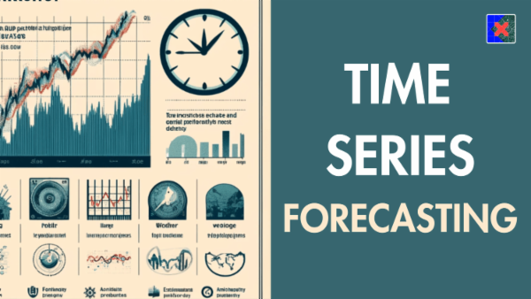

# Indigo AirPassanger Time Series

# 📌Overview
This project performs a time series analysis on the classic Air Passengers dataset, which records monthly passenger numbers from January 1949 to December 1960. The primary goal is to explore the dataset, preprocess it, and apply time series forecasting techniques (e.g., ARIMA) to predict future passenger numbers. This repository demonstrates data cleaning, exploratory data analysis (EDA), and forecasting using Python.

# 📂Dataset
**Description**
- The dataset contains monthly totals of international airline passengers from 1949 to 1960, often used as a benchmark for time series analysis.

- Source: AirPassengers.csv (assumed to be available locally or downloadable).
- Size: 144 rows, 2 columns.
**Columns:**
- Month: Date in YYYY-MM format (e.g., 1949-01), converted to datetime64[ns] during preprocessing.
- #Passengers: Number of passengers (integer).
- Time Period: January 1949 to December 1960.
- Features: The data exhibits clear trends and seasonality, making it ideal for time series modeling.

# 🛠Methodology
**Dependencies**
- The project relies on the following Python libraries:
  
      import pandas as pd
      import numpy as np
      import matplotlib.pyplot as plt
      import seaborn as sns
      from sklearn.preprocessing import StandardScaler
      from mlxtend.frequent_patterns import apriori, association_rules
      from statsmodels.tsa.seasonal import seasonal_decompose
      from statsmodels.tsa.arima_model import ARIMA

# 🚀Approach
**Data Loading and Preprocessing:**
- Load the dataset from AirPassengers.csv.
- Convert the Month column to datetime64[ns] format.
- Set Month as the DataFrame index for time series analysis.
- Check for duplicates (none found) and ensure data integrity.
**Exploratory Data Analysis (EDA):**
- Inspect dataset structure (144 rows, 2 columns).
- Visualize passenger trends over time using matplotlib.
**Time Series Modeling:**
- Apply ARIMA (AutoRegressive Integrated Moving Average) for forecasting.
- Generate a 24-month forecast using the trained model.
- Plot original data and forecasted values for comparison.
**Evaluation:**
- Visual inspection of forecast accuracy via plots (quantitative metrics like MAE or RMSE can be added).

# 📊Results
- EDA Findings: The dataset shows a clear upward trend and annual seasonality in passenger numbers.
- Forecasting: A 24-month forecast was generated, though specific ARIMA parameters (p, d, q) and quantitative accuracy metrics are not detailed in the notebook snippet 
  provided. The forecast plot visually aligns with the observed trend.

# 🚀Future Work
- Add quantitative evaluation metrics (e.g., MAE, RMSE) for the forecast.
- Experiment with other models like SARIMA or Prophet to capture seasonality more effectively.
- Include decomposition analysis (seasonal_decompose) results in the README or notebook.
